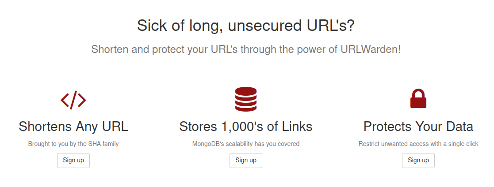

<h1 align="center">URLWarden</h1>

<h2 align="center"><i>Shorten your URL's without sacrificing security or scalability!</i></h2>

URLWarden is a clone of a service like Bitly or TinyURL and thus performs a similar service of shortening and storing URL's. The inspiration behind this project was to design with scaliability in mind. The one major difference with URLWarden as opposed to the other services mentioned is that it requires user signup to work. In this manner, additional features such as expiration dates and usage metrics can be applied, with certain features being restricted to premium accounts. Payment services have been implemented utilizing the Stripe API.

URLWarden is primarily written in Python through the Flask microframework. Docker, Redis, and MongoDB aid with deployment, caching, and storage, respectively.

## Table of Contents

- [Contributing](#Contributing)
- [Credits](#Credits)
- [License](#License)

## Contributing

Although URLWarden was designed as an educational project, any contributions or suggestions are greatly appreciated! If you would like to contribute to the codebase, please follow these steps:

```
1. Create an issue
2. Fork the repo
3. Create a branch*
4. Make your changes
5. Write unit tests as applicable

6. Check static typing through mypy
7. Format the codebase using black
8. Ensure that your changes passes all tests using pytest
9. Squash your changes to as few commits as possible*
10. Make a pull request* (can optionally be earlier on if a complex task)
```

<i>\*Please use the issue number and name when possible to improve clarity and project maintainability (i.e. "134-AddTernaryOperator"). Additionally, please adhere to [Conventional Commits](https://www.conventionalcommits.org/en/v1.0.0/) standards.<br></i>

## Credits

This project would not have have been possible without the entire Recurse Center community. The Designing Data Intensive Application's study group and various pairing sessions on scalable, resilient design made this project much easier to tackle!

## License

The URLWarden project is licensed under the MIT License Copyright (c) 2021.

See the [LICENSE](https://github.com/cdkini/urlwarden/LICENSE) for information on the history of this software, terms & conditions for usage, and a DISCLAIMER OF ALL WARRANTIES.

All trademarks referenced herein are property of their respective holders.
